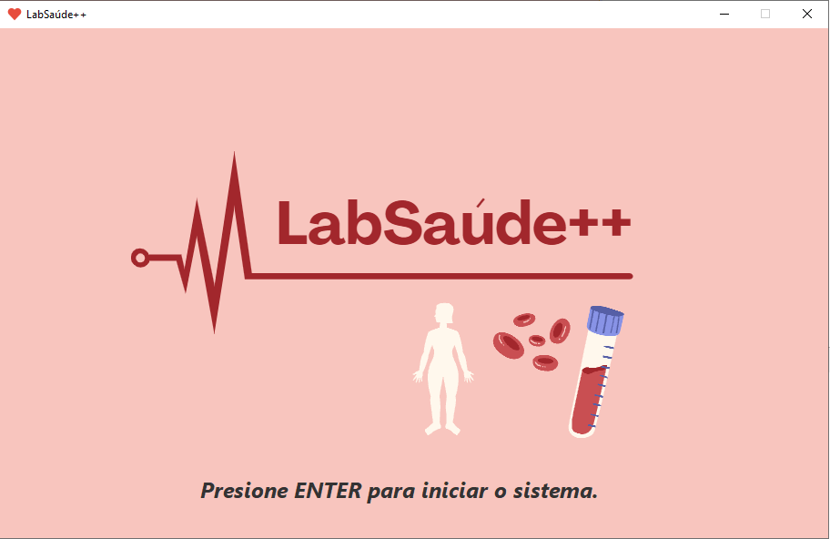
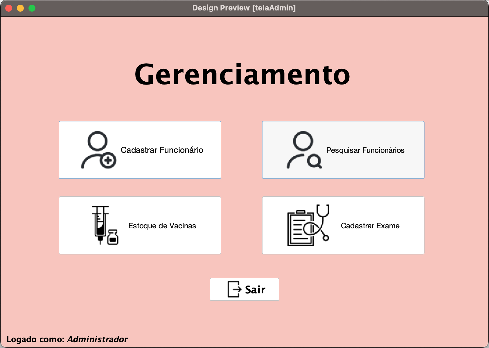
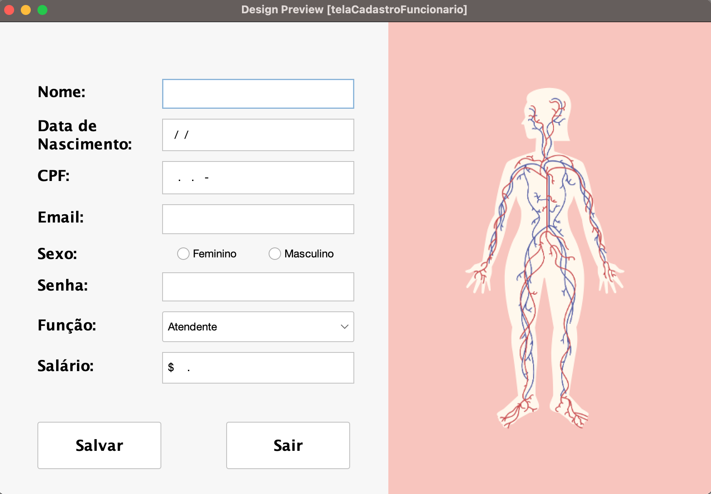
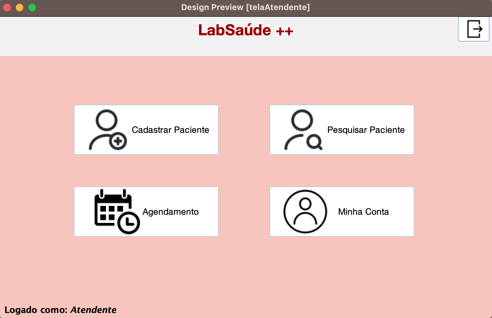
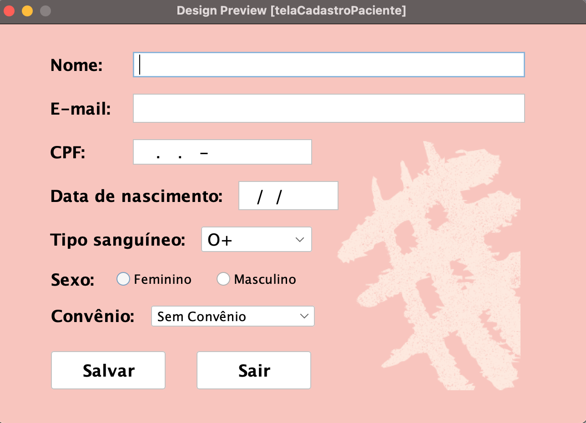
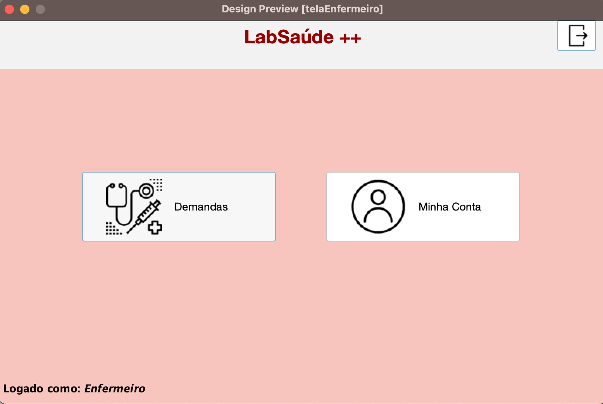
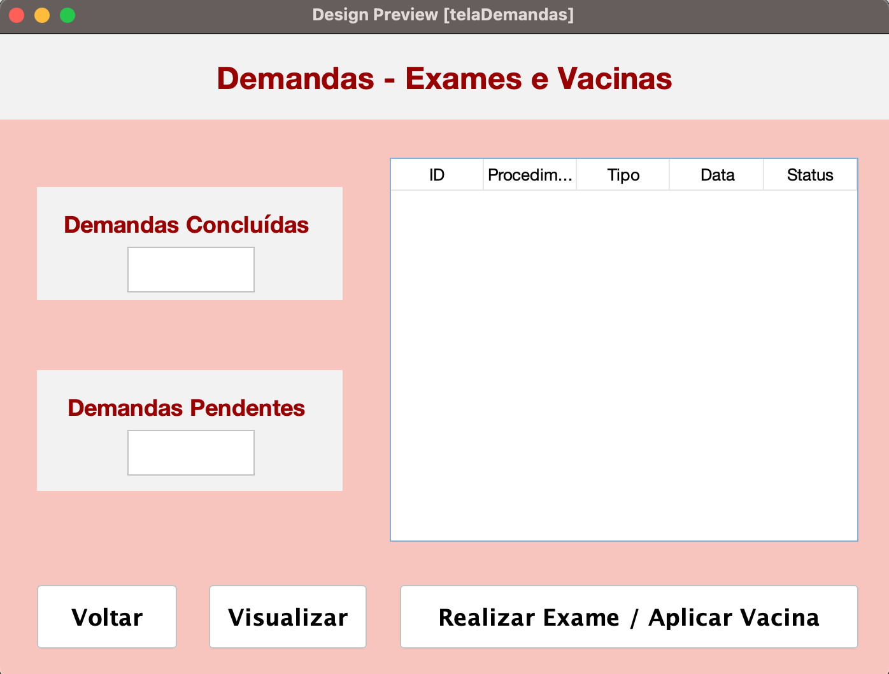
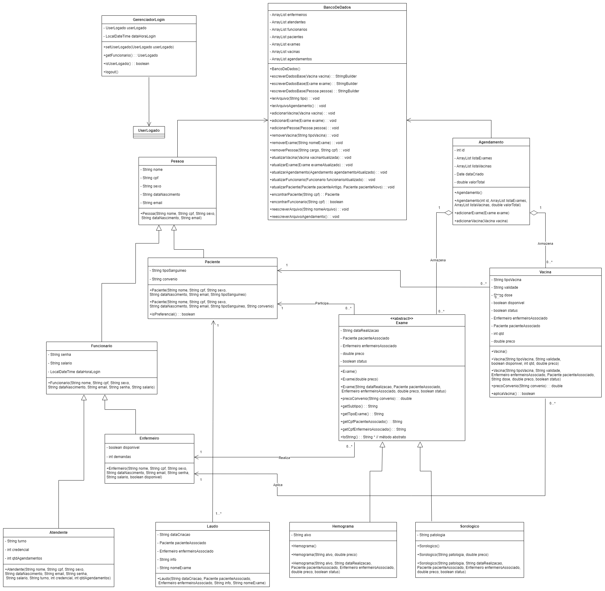

# LabSaúde++

  

**Trabalho final da disciplina de Técnicas de Programação 1**

Um projeto desenvolvido em Java com o objetivo de fornecer uma solução completa para o gerenciamento de um laboratório de saúde. O sistema visa facilitar a interação dos usuários administradores e funcionários com a base de dados da empresa, incluindo cadastro de pacientes e funcionários, agendamento de exames e vacinas e emissão de resultados de forma eficiente, proporcionando uma experiência amigável com interface gráfica.

## 🚀 Funcionalidades e Regras de Negócio

### Controle de Acesso e Perfis
O sistema possui controle de acesso com permissões divididas em **Administrador**, **Atendente** e **Enfermeiro**:

#### Administrador
Responsável pelo gerenciamento do laboratório.
- **Gerenciamento de Funcionários**: Cadastro, pesquisa e demissão/exclusão.
- **Estoque de Vacinas**: Cadastro, edição, pesquisa e exclusão de vacinas do estoque.
- **Gerenciamento de Exames**: Cadastro e manutenção dos exames oferecidos.

  
  

#### Atendente
Responsável pelo atendimento direto ao público.
- **Pacientes**: Cadastro, pesquisa e edição de dados.
- **Agendamentos**: Gerenciar agendamentos de exames e vacinas para os pacientes.
- **Pagamentos**: Administração da etapa final do atendimento, exibindo e calculando os pagamentos.

  
  

#### Enfermeiro
Responsável pela execução dos serviços médicos.
- **Demandas**: Acesso às solicitações agendadas de aplicação de vacinas e realização de exames, além da visualização de resultados de demandas concluídas.
- **Vacinação**: Realiza a aplicação e deduz as vacinas do estoque, emitindo o *Cartão de Vacina*.
- **Exames**: Executa os exames agendados, lança os resultados e conclui a demanda gerando o *Laudo Médico*.

  
  

### 💰 Regras de Negócio: Descontos
- Aplicação de regras de negócio para **descontos** em exames/vacinas baseados em regras específicas:
  - **Convênios**: Unimed (10%), Amil (15%), Bradesco Saúde (25%), Porto Seguro (30%). Diferentes coberturas se aplicam para exames de sangue, exames sorológicos e vacinas.
  - **Preferencial**: Descontos atribuídos para pacientes em idade avançada (idosos).

### 💾 Persistência e Padrões
- Banco de dados inteiramente baseado em leitura e gravação em arquivos `.csv`, implementando rotinas de CRUD (Create, Read, Update, Delete) completas via a classe genérica `BancoDeDados`.
- Utilização do Padrão **Singleton** e a interface `UserLogado` (implementada pela superclasse `Funcionario`) para gerenciar as sessões, garantindo que as modificações e rastreabilidade estejam atreladas ao usuário em uso.

## 📂 Estrutura do Projeto
- `LabProject/src/`: Códigos-fonte estruturados em pacotes.
  - `classes/`: Classes de modelos do domínio (Pessoas, Vacinas, Exames, etc.)
  - `database/`: Conexão, leitura/gravação de dados em `.csv`
  - `interfaces/`: Definições arquiteturais, como `UserLogado`
  - `telas/`: Interface gráfica construída em Java Swing 
- `LabProject/database/`: Registros locais gerados via persistência de arquivos `.csv`.
- `UML/`: Modelagem visual.
- `Relatório_Final___LabSaúde__/`: Toda a documentação técnica, detalhando fluxo de usuários, relatórios e manuais de telas.

## 💻 Diagrama de Classes
Abaixo apresentamos o diagrama UML de domínio, especificando a hierarquia das classes, atributos, polimorfismo, interfaces e o encapsulamento.

  

## 📦 Tecnologias Utilizadas
- **Linguagem**: Java
- **Interface Gráfica**: Java Swing (construção visual do zero às requisições interativas).
- **Persistência de Dados**: `.csv` com o uso das bibliotecas essenciais de File I/O do Java.
- **Manipulação de PDF**: `iTextPDF` (Geração dos cartões de vacina, comprovantes e laudos).
- **Componentes Externos UI**: `JCalendar` e `JDateChooser` integrados ao Apache NetBeans.

## 🛠️ Como executar
1. Importe o diretório `LabProject` em uma IDE de sua escolha (recomendado: Apache NetBeans com suporte a sistema nativo de construção baseada no arquivo `build.xml` do diretório `nbproject`).
2. Adicione os arquivos `.jar` contidos na pasta `LabProject/lib/` ao **Classpath/Libraries** do projeto.
3. Não altere a estrutura diretiva da persistência (a pasta `database`), ela já está configurada previamente na raiz do sistema para manipulações. 
4. Execute o programa utilizando a classe base `LabProject.java` localizada em `src/classes/LabProject.java`.  

## 👩‍💻 Equipe
- [Ana Luísa de Souza Paraguassu](https://github.com/anaparaguassu)
- [Arthur da Silva Pereira Bispo](https://github.com/arthurxsz)
- [João Carlos Gonçalves de Oliveira Filho](https://github.com/ogjoaoc)
